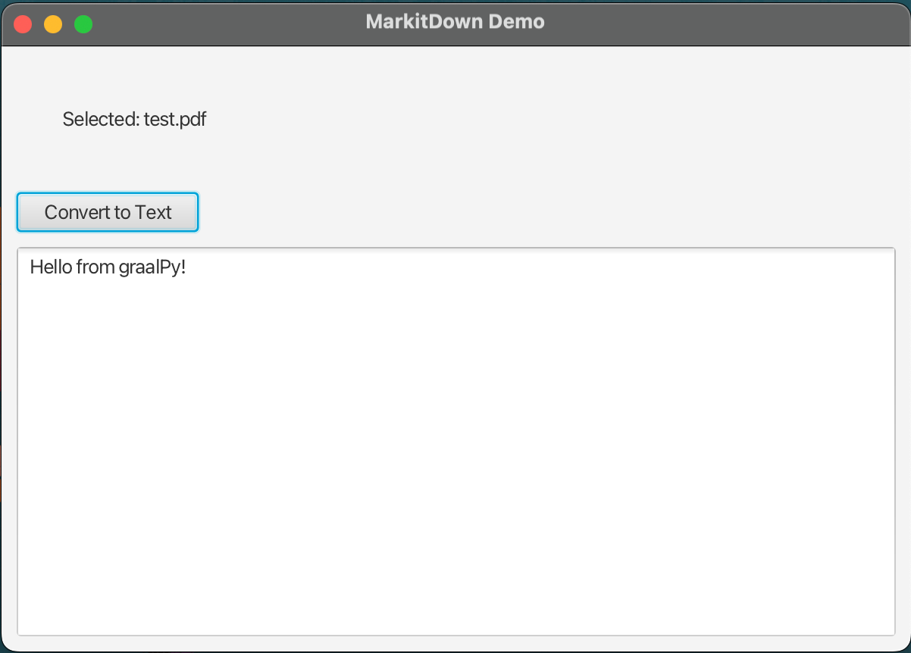

## MarkitDown in Java Application 

## 1. Getting Started

In this guide, we will demonstrate how to use [MarkitDown](https://github.com/microsoft/markitdown) within a Java interface.

## 2. What you will need

To complete this guide, you will need the following:

* Some time on your hands
* A decent text editor or IDE
* A supported JDK[^1], preferably the latest [GraalVM JDK](https://graalvm.org/downloads/)

  [^1]: Oracle JDK 17 and OpenJDK 17 are supported with interpreter only.
  GraalVM JDK 21, Oracle JDK 21, OpenJDK 21 and newer with [JIT compilation](https://www.graalvm.org/latest/reference-manual/embed-languages/#runtime-optimization-support).
  Note: GraalVM for JDK 17 is **not supported**.


## 3. Writing the application

We will use Maven to run a JavaFX example application that integrates MarkitDown using GraalPy.

### 3.1 Dependency configuration


Add the required dependencies for GraalPy in the dependency section of the POM build script.


`pom.xml`

```xml
  <dependency>
    <groupId>org.graalvm.python</groupId>
    <artifactId>python-community</artifactId> <!-- ① -->
    <version>${graalpy.version}</version>
    <type>pom</type> <!-- ② -->
  </dependency>
  <dependency>
    <groupId>org.graalvm.python</groupId>
    <artifactId>python-embedding</artifactId> <!-- ③ -->
    <version>${graalpy.version}</version>
  </dependency>

```


❶ The `python-community` dependency is a meta-package that transitively depends on all resources and libraries to run GraalPy.

❷ Note that the `python-community` package is not a JAR - it is simply a pom that declares more dependencies.

❸ The `python-embedding` dependency provides the APIs to manage and use GraalPy from Java.


### 3.2 JavaFx dependencies and pluging 

To build a graphical interface, we use JavaFX.

`pom.xml`:
```xml
<dependency>
  <groupId>org.openjfx</groupId>
  <artifactId>javafx-controls</artifactId>  <!-- ① -->
  <version>23.0.1</version>
</dependency>
```

```xml
<plugin>
  <groupId>org.openjfx</groupId>
  <artifactId>javafx-maven-plugin</artifactId> <!-- ② -->
  <version>0.0.8</version>
  <configuration>
      <mainClass>org.example.App</mainClass>
  </configuration>
</plugin>
```
❶ The `javafx-controls` dependency contains the core UI controls (buttons, labels, text areas, etc.) needed to create our application window.

❷ The `javafx-maven-plugin` plugin allows us to run JavaFX applications directly with Maven, without needing manual configuration of the JavaFX runtime.

### 3.3 Adding packages - GraalPy build plugin configuration
```xml
<plugin>
    <groupId>org.graalvm.python</groupId>
    <artifactId>graalpy-maven-plugin</artifactId>
    <version>${graalpy.version}</version>
    <executions>
        <execution>
            <configuration>
                <packages> <!-- ① -->
                    <!-- Select Python packages to install via pip. -->
                   <package>markitdown[all]</package> <!-- ② -->
                    <!-- Add any other packages here -->
                </packages>
            </configuration>
            <goals>
                <goal>process-graalpy-resources</goal>
            </goals>
        </execution>
    </executions>
</plugin>
```


❶ The packages section lists all Python packages optionally with requirement specifiers.

❷ Python packages are specified as if used with pip (latest version or pinned version)


### 3.4 Creating a Python context


GraalPy makes setting up a context to load Python packages from Java straightforward.

`src/main/java/org/example/App.java`

```java

@Override
public void start(Stage stage) {
  context = GraalPyResources.contextBuilder()
          .allowAllAccess(true) // ①
          .option("python.WarnExperimentalFeatures", "false") // ②
          .build(); // ③

  setupWindow(stage);
}

```

❶ Allow environment access.


❷ Set GraalPy option to not log a warning every time a native extension is loaded.


❸ Create the context with the given configuration.


### 3.5 Initialize Python module

We'll create a Python module in this section and bind it to a Java interface, allowing the Java interface to call Python methods defined in the module.

All Python source code should be placed in `src/main/resources/org.graalvm.python.vfs/src`

`src/main/resources/org.graalvm.python.vfs/src/convert_files.py`


```python
from markitdown import MarkItDown

def convert(file: str) -> str: # ①
  md = MarkItDown(enable_plugins=False)
    result = md.convert(file)
    return result.text_content
```


❶ The `convert` function converts any supported file format to plain text.


### 3.5.1 Binding Java interface with Python code


Define a Java interface with method signatures matching the Python functions.

`src/main/java/org/example/ConvertFiles.java`


```java

package org.example;

public interface ConvertFiles {
  String convert(String file);
}

```
Bind the Java interface to the Python module.

```java
private void convertFileWithGraalPy(File file, TextArea textArea) {
        try {
            textArea.setText("Converting...");
            Value value = context.eval("python", "import convert_files; convert_files");
            convertFiles = value.as(ConvertFiles.class);
            String text = convertFiles.convert(file.getAbsolutePath());
            textArea.setText(text);
        } catch (Exception e) {
            textArea.setText("Error: " + e.getMessage());
        }
    }
```


### 3.5.2 Creating a JavaFX Window


The JavaFX UI allows users to drag & drop or select files to convert to text.

`src/main/java/org/example/App.java`


```java

private void setupWindow(Stage stage) {

  Label fileLabel = new Label("Drag file here or click to upload");
  fileLabel.setStyle("-fx-border: 2px dashed #ccc; -fx-padding: 20; -fx-alignment: center;");

  HBox fileSection = new HBox(10);
  fileSection.getChildren().add(fileLabel);
  fileSection.setPadding(new Insets(10));

  Button convertButton = new Button("Convert to Text");
  convertButton.setDisable(true);
  convertButton.setPrefWidth(120);

  fileLabel.setOnDragOver(event -> {
    if (event.getDragboard().hasFiles()) {
      event.acceptTransferModes(TransferMode.COPY);
    }
    event.consume();
  });

  fileLabel.setOnDragDropped(event -> {
    Dragboard db = event.getDragboard();
    if (db.hasFiles()) {
      List<File> files = db.getFiles();
      if (!files.isEmpty()) {
        selectedFile = files.get(0);
        fileLabel.setText("Selected: " + selectedFile.getName());
        convertButton.setDisable(false);
      }
    }
    event.consume();
  });

  fileLabel.setOnMouseClicked(e -> {
    javafx.stage.FileChooser fileChooser = new javafx.stage.FileChooser();
    fileChooser.getExtensionFilters().addAll(
            new javafx.stage.FileChooser.ExtensionFilter("Documents", "*.pdf", "*.docx", "*.pptx", "*.txt"),
            new javafx.stage.FileChooser.ExtensionFilter("All Files", "*.*")
    );

    File file = fileChooser.showOpenDialog(stage);
    if (file != null) {
      selectedFile = file;
      fileLabel.setText("Selected: " + file.getName());
      convertButton.setDisable(false);
    }
  });
  convertButton.setDisable(true);
  convertButton.setPrefWidth(120);

  TextArea textArea = new TextArea();
  textArea.setWrapText(true);
  textArea.setPromptText("Converted text will appear here...");
  VBox.setVgrow(textArea, Priority.ALWAYS);

  convertButton.setOnAction(e -> {
    if (selectedFile != null) {
      convertFileWithGraalPy(selectedFile, textArea);
    }
  });

  VBox layout = new VBox(10);
  layout.getChildren().addAll(fileSection, convertButton, textArea);
  layout.setPadding(new Insets(10));

  Scene scene = new Scene(layout, 600, 400);
  stage.setScene(scene);
  stage.setTitle("MarkitDown Demo");
  stage.show();
}

```


### 4 Running the Application

If you followed along with the example, you can now compile and run your application from the commandline:

```shell
mvn compile
mvn javafx:run
```

