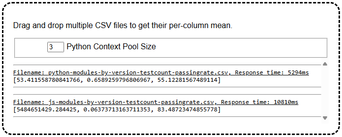

## GraalPy Micronaut Multithreaded Guide

## 1. Getting Started

In this guide, we will use the Python library [NumPy](https://numpy.org) from a Micronaut application written in Java to process CSV files.
NumPy is a native library and Python has a [Global Interpreter Lock](https://wiki.python.org/moin/GlobalInterpreterLock) that limits multithreading to use a single core at a time.
Using GraalPy, we can lift that limitation and process requests on multiple threads using multiple CPU cores in parallel.


## 2. What you will need

To complete this guide, you will need the following:

* Some time on your hands
* A decent text editor or IDE
* A supported JDK[^1], preferably the latest [GraalVM JDK](https://graalvm.org/downloads/)

  [^1]: Oracle JDK 17 and OpenJDK 17 are supported with interpreter only.
  GraalVM JDK 25, Oracle JDK 21+, OpenJDK 21+ and newer with [JIT compilation](https://www.graalvm.org/latest/reference-manual/embed-languages/#runtime-optimization-support).

## 3. Solution

We recommend that you follow the instructions in the next sections and create the application step by step.
However, you can go right to the [completed example](./).

## 4. Writing the application

Create an application using the [Micronaut Command Line Interface](https://docs.micronaut.io/latest/guide/#cli) or with [Micronaut Launch](https://micronaut.io/launch/).
We also recommend to use Micronaut version 4.7.4 or newer.
You can choose to build with either Maven or Gradle.

```bash
mn create-app org.example.demo \
--build=maven \
--lang=java \
--features=views-thymeleaf,graalvm \
--test=junit
```

```bash
mn create-app org.example.demo \
--build=gradle_kotlin \
--lang=java \
--features=views-thymeleaf,graalvm \
--test=junit
```

The `views-thymeleaf` feature will be used to render the index page, the `graalvm` feature enables the Micronaut integration with GraalVM Native Image.

### 4.1. Application

The generated Micronaut application will already contain the file  _Application.java_, which is used when running the application via Maven or via deployment.
You can also run the main class directly within your IDE if it is configured correctly.

`Application.java`
```java
public class Application {

    public static void main(String[] args) {
        Micronaut.run(Application.class, args);
    }
}
```

### 4.2 Dependency configuration

Add the required dependencies for GraalPy in the section of the POM file for Maven.
For Gradle, the GraalPy Gradle plugin that we will add in the next section will inject these dependencies automatically.

`pom.xml`
```xml
<dependency>
  <groupId>org.graalvm.python</groupId>
  <artifactId>python</artifactId> <!-- ① -->
  <version>24.2.1</version>
  <type>pom</type> <!-- ② -->
</dependency>
<dependency>
  <groupId>org.graalvm.python</groupId>
  <artifactId>python-embedding</artifactId> <!-- ③ -->
  <version>24.2.1</version>
</dependency>
```

❶ The `python` dependency is a meta-package that transitively depends on all resources and libraries to run GraalPy.

❷ Note that the `python` package is not a JAR - it is simply a `pom` that declares more dependencies.

❸ The `python-embedding` dependency provides the APIs to manage and use GraalPy from Java.

### 4.3 Adding packages - GraalPy build plugin configuration

Most Python packages are hosted on [PyPI](https://pypi.org) and can be installed via the `pip` tool.
The Python ecosystem has conventions about the filesystem layout of installed packages that need to be kept in mind when embedding into Java.
You can use the GraalPy plugins for Gradle and Maven to manage Python packages for you.

Add the `graalpy-maven-plugin` configuration into the plugins section of the POM or the `org.graalvm.python` plugin dependency and a `graalPy` block to your Gradle build to include the required dependencies for the running operating system:

`pom.xml`
```xml
<plugin>
  <groupId>org.graalvm.python</groupId>
  <artifactId>graalpy-maven-plugin</artifactId>
  <version>24.2.1</version>
  <configuration>
    <packages> <!-- ① -->
      <package>numpy==1.26.4</package> <!-- ② -->
      <package>--no-binary=numpy</package> <!-- ③ -->
      <package>${patchpkg}</package> <!-- ④ -->
    </packages>
  </configuration>
  <executions>
    <execution>
      <goals>
        <goal>process-graalpy-resources</goal>
      </goals>
    </execution>
  </executions>
</plugin>
```

`pom.xml`
```xml
<profiles> <!-- ④ -->
  <profile>
    <id>windows</id>
    <activation>
      <os><family>windows</family></os>
    </activation>
    <properties>
      <patchpkg>delvewheel==1.10.0</patchpkg>
    </properties>
  </profile>
  <profile>
    <id>macos</id>
    <activation>
      <os><family>mac</family></os>
    </activation>
    <properties>
      <patchpkg>delocate==0.13.0</patchpkg>
    </properties>
  </profile>
  <profile>
    <id>linux</id>
    <activation>
      <os><family>unix</family></os>
    </activation>
    <properties>
      <patchpkg>patchelf==0.17.2.2</patchpkg>
    </properties>
  </profile>
</profiles>
```

`build.gradle.kts`
```
plugins {
    id("org.graalvm.python") version "24.2.1"
    // ...
```

`build.gradle.kts`
```
packages = setOf( // ①
    "numpy==1.26.4", // ②
    "--no-binary=numpy", // ③
    mapOf( // ④
        "linux" to "patchelf==0.17.2.2",
        "windows" to "delvewheel==1.10.0",
        "mac" to "delocate==0.13.0"
    )[System.getProperty("os.name").split(" ")[0].toLowerCase()]
)
```

❶ The `packages` section lists all Python packages optionally with [requirement specifiers](https://pip.pypa.io/en/stable/reference/requirement-specifiers/).

❷ Python packages and their versions can be specified as if used with pip.
Install and pin the `numpy` package to version `1.26.4`.

❸ Currently the support for isolating native modules and loading them multiple times relies on packages built from source on the target system.
Until this limitation is lifted, we must force the plugins to build `numpy` from source.

❹ The implementation of native module isolation uses platform-specific helper packages at runtime.
These are selected here depending on the operating system.

### 4.4 Writing a Python script for use from Java

[NumPy](https://numpy.org) is a very rich library with many modules, so for some projects it makes sense to write a small Python module that exposes the functionality we need in a more convenient way.
Python modules stored in the resources folder `org.graalvm.python.vfs/src` will be shipped in the Jar and automatically end up on the import path of GraalPy at runtime.

`src/main/resources/org.graalvm.python.vfs/src/data_analysis.py`
```python
import io
import numpy as np


def mean(csv: str) -> list[float]:
    ary = np.genfromtxt(io.StringIO(csv), delimiter=",", invalid_raise=False)
    return ary.transpose().mean(axis=1).tolist()
```

This module exposes a single function `mean` that we can call from Java with a CSV string.
It will calculate the mean value for each column of the CSV and returns a list of floating point numbers.
(For columns with non-numeric values, that mean value will be `NaN`.)
Return values and arguments are mapped according to a set of [generic rules](https://www.graalvm.org/latest/reference-manual/python/Modern-Python-on-JVM/#java-to-python-types-automatic-conversion) as well as the [Target type mapping](https://www.graalvm.org/truffle/javadoc/org/graalvm/polyglot/Value.html#target-type-mapping-heading).


### 4.5 Managing Python parallelism with an executor service

NumPy is a native library and Python has a [Global Interpreter Lock](https://wiki.python.org/moin/GlobalInterpreterLock) that limits multithreading to use a single core at a time.
Using GraalPy, we can lift that limitation and process requests on multiple threads using multiple CPU cores in parallel.
This works by using multiple GraalPy contexts, each with independent instances of all Python global state, including the global state within NumPy.

**IMPORTANT**: While the global state is isolated, all code is executing in the same process.
Native code theoretically has access to all memory in the process and so theoretical vulnerabilities in Python native extensions like NumPy may allow attackers to craft input to exploit such vulnerabilities and break the isolation between GraalPy contexts.
The GraalPy mechanism for multi-threading we describe here is not a security boundary.

`PythonPool.java`
```java
@io.micronaut.context.annotation.Context // ①
public class PythonPool {
    private final Engine engine;
    private final BlockingDeque<Context> contexts;
    private int size;

    public PythonPool() {
        engine = Engine.create(); // ②
        contexts = new LinkedBlockingDeque<>(); // ③
        size = 0;
        setPoolSize(2); // ④
    }
```

❶ The Micronaut [Context](https://docs.micronaut.io/latest/api/io/micronaut/context/annotation/Context) annotation indicates that the `PythonPool` class should be a singleton for the application and is initialized with the application.

❷ A Truffle [Engine](https://www.graalvm.org/truffle/javadoc/org/graalvm/polyglot/Engine.html) is used to share compiled code, which improves warmup and memory footprint.

❸ A [Context](https://www.graalvm.org/truffle/javadoc/org/graalvm/polyglot/Context.html) in Truffle is an isolated GraalPy interpreter state.
All GraalPy contexts are chained in a simple Deque and the pool just does round-robin scheduling of jobs.

❹ We have randomly picked an initial pool size of 2.

`PythonPool.java`
```java
public synchronized void setPoolSize(int newSize) { // ①
    if (newSize <= 0) {
        throw new IllegalArgumentException();
    }
    while (size > newSize) {
        try {
            contexts.takeLast();
        } catch (InterruptedException e) {
            throw new RuntimeException(e);
        }
        size--;
    }
    while (size < newSize) {
        contexts.addLast(createContext(engine));
        size++;
    }
}

private static Context createContext(Engine engine) {
    var resourcesDir = Path.of(System.getProperty("user.dir"), "graalpy.resources");
    if (!resourcesDir.toFile().isDirectory()) { // ②
        var fs = VirtualFileSystem.create();
        try {
            GraalPyResources.extractVirtualFileSystemResources(fs, resourcesDir);
        } catch (IOException e) {
            throw new RuntimeException(e);
        }
    }
    var context = GraalPyResources.contextBuilder(resourcesDir)
        .engine(engine)
        .allowNativeAccess(true) // ③
        .allowCreateProcess(true) // ④
        .allowExperimentalOptions(true)
        .option("python.IsolateNativeModules", "true") // ⑤
        .build();
    context.initialize("python");
    return context;
}
```

❶ The `setPoolSize` method can be used to dynamically resize the available GraalPy pool.
This size directly corresponds to the maximum parallelism of Python code.

❷ The GraalPy plugins for Maven and Gradle ship packages and Python resources in the application JAR.
However, to use multiple instances of native libraries like NumPy, we extract them to the real filesystem at runtime.
The location can be a temporary directory or any other writable location with write and execute rights for the current user.
Here, we are simply extracting to the current working directory if that has not already happened.

❸ GraalPy contexts are locked down by default.
Since NumPy is a native library, we need to explicitly enable native access.

❹ GraalPy's mechanism for native library isolation spawns helper processes to modify the libraries before loading them, so we have to enable that capability.
These modifications ensure native libraries can be loaded multiple times into the same JVM without sharing global state.

❺ Finally, we set the experimental option `IsolateNativeModules` to `true`.
This instructs GraalPy to intercept loading native Python extension libraries and apply our isolation to it.

`PythonPool.java`
```java
public <T> T execute(Function<Context, T> action) {
    Context c;
    try {
        c = contexts.takeFirst(); // ①
    } catch (InterruptedException e) {
        throw new RuntimeException(e);
    }
    contexts.addLast(c);
    T result = action.apply(c);
    if (!(result instanceof Number || result instanceof String)) { // ②
        throw new IllegalStateException("Instances must not leak out of PythonPool#execute. " +
                        "Convert the value to a java.lang.Number or a java.lang.String, before returning it.");
    }
    return result;
}
```

❶ Our `PythonPool` provides an `execute` method to submit jobs to.
In this method, we move the first context from our linked list to the end, implementing a simple round-robin selection.
The action then executes on the selected contexts.

❷ Users of the pool should not return instances from their actions, because these might have references to the context they ran on, negating the usefulness of the pool.

### 4.6 Index page

The application will have a simple drop-target into which a user can drag and drop CSV files.
Each CSV file will cause a request to the application to get the per-column mean values.
Thus, multiple requests may have to be handled in parallel by GraalPy using NumPy.

Create a html file, which will be later on rendered with the help of the `thymeleaf` library:

`src/main/resources/views/index.html`
```html
<!DOCTYPE html>
<html xmlns:th="http://www.thymeleaf.org">
    <head>
        <title>Demo App</title>
        <script language="javascript">
            document.addEventListener("DOMContentLoaded", () => {
                let dropArea = document.getElementById("drop-area");
                ["dragenter", "dragover", "dragleave", "drop"].forEach(en => {
                    [dropArea, document.body].forEach(el => el.addEventListener(en, e => { e.preventDefault(); e.stopPropagation() }, false))
                });
                ["dragenter", "dragover"].forEach(en => dropArea.addEventListener(en, () => dropArea.classList.add("highlight"), false));
                ["dragleave", "drop"].forEach(en => dropArea.addEventListener(en, () => dropArea.classList.remove("highlight"), false));
                dropArea.addEventListener(
                    "drop",
                    (e) => {
                        var files = [...e.dataTransfer.files]
                        files.forEach((file, i) => {
                            var xhr = new XMLHttpRequest();
                            var formData = new FormData();
                            var begin;
                            xhr.addEventListener("readystatechange", e => {
                                if (xhr.readyState == 1) {
                                    begin = Date.now();
                                } else if (xhr.readyState == 4) {
                                    let response = document.createElement("pre");
                                    response.innerHTML = `<hr><u>Filename: ${file.name}, Response time: ${Date.now() - begin}ms</u><br>${xhr.responseText}<hr>`;
                                    let responses = document.getElementById("responses");
                                    responses.appendChild(response);
                                    responses.scrollTop = responses.scrollHeight;
                                }
                            });
                            xhr.open("POST", "/data_analysis", true);
                            formData.append("poolSize", document.getElementById("poolSize").value);
                            formData.append("file", file);
                            xhr.send(formData);
                        });
                    },
                    false);
            });
        </script>
        <style>
            #drop-area.highlight { border-color: purple; }
        </style>
    </head>
    <body style="font-family:sans-serif">
        <div id="drop-area" style="border-style:dashed;border-radius:20px;width:640px;margin:auto;padding:20px;">
            <form class="my-form">
                <p>Drag and drop multiple CSV files to get their per-column mean.</p>
                <fieldset>
                    <div>
                        <input type="number" id="poolSize" style="width:2em;margin-left:4em" value="3">
                        <label for="poolSize">Python Context Pool Size</label>
                    </div>
                </fieldset>
                <input type="file" id="fileElem" multiple accept=".csv" onchange="handleFiles(this.files)" style="display:none">
            </form>
            <div id="responses" style="max-height:20em;overflow-y:scroll"></div>
        </div>
    </body>
</html>
```

### 4.7 Controller

To create a microservice that provides our simple CSV "analysis", we also need a controller:

`DataAnalysisController.java`
```java
@Controller // ①
public class DataAnalysisController {
    private final PythonPool pool;

    public DataAnalysisController(PythonPool pool) { // ②
        this.pool = pool;
    }

    @Get // ③
    @View("index") // ④
    public void index() {
    }

    @Post(value = "/data_analysis", consumes = MediaType.MULTIPART_FORM_DATA, produces = MediaType.TEXT_PLAIN) // ⑤
    @ExecuteOn(TaskExecutors.IO) // ⑥
    String analyzeCsvMulti(StreamingFileUpload file,
                    @Part("poolSize") String poolSizeString) {
        try {
            pool.setPoolSize(Integer.parseInt(poolSizeString));
            String csv = new String(file.asInputStream().readAllBytes(), "UTF-8");
            return pool.execute((c) -> { // ⑦
                return c.eval("python", "import data_analysis; data_analysis").invokeMember("mean", csv).toString();
            });
        } catch (Exception e) {
            throw new HttpStatusException(HttpStatus.BAD_REQUEST, e.getMessage());
        }
    }
}
```

❶ The class is defined as a controller with the [@Controller](https://docs.micronaut.io/latest/api/io/micronaut/http/annotation/Controller.html) annotation.

❷ Use constructor injection to inject the singleton instance of `PythonPool` that the Micronaut framework manages for us.

❸ The [@Get](https://docs.micronaut.io/latest/api/io/micronaut/http/annotation/Get.html) annotation maps the `index` method to an HTTP GET request on "/".

❹ The `thymeleaf` [@View](https://micronaut-projects.github.io/micronaut-views/latest/api/io/micronaut/views/View.html) annotation indicates that _resources/views/index.html_ should be rendered on a HTTP GET request.

❺ The [@Post](https://docs.micronaut.io/latest/api/io/micronaut/http/annotation/Post.html) annotation maps the path `/data_analysis` to a HTTP POST request.
We declare the endpoint to consume form data and produce plain text.
The form data is passed as arguments to the method by the Micronaut framework.

❻ Since the computation is somewhat CPU intensive, we offload it from the Netty event loop using `@ExecuteOn(TaskExecutors.BLOCKING)`.

❼ We use the `PythonPool` to submit a job.
When the job runs, we import the `data_analysis` module we defined earlier and invoke its `mean` method.
We simply pass the CSV string (the contents of the uploaded file) as argument.

Note that we catch all exceptions that might occur and handle them with a generic response code.
In a more fleshed out application, consider using asynchronous patterns to respond when the analysis is ready and to handle specific exceptions that we would expect.

## 5. Running the application

Now we have everything in place to run the application:

```bash
./mvnw mn:run
```

or

```bash
./gradlew run
```

This will start the application on port 8080.
Try dropping different numbers of CSV files on to the drop target while varying the pool size.
Observe the request times and CPU usage of your machine.
After a few warmup rounds, you will see scaling over your available CPU cores depending on the size of the pool you use.

We provide example CSV files from our [GraalPy](./python-modules-by-version-testcount-passingrate.csv) and [GraalJS](./js-modules-by-version-testcount-passingrate.csv) package compatibility for trying it out.
The scaling we can achieve for a small number of clients on a client machine can look something like this:


## 6. Next steps

- Check out our general [Micronaut guide](../graalpy-micronaut-guide/README.md) if you have not done so already to learn how GraalVM native image works with GraalPy as well.
- Use GraalPy in a [Java SE application](../graalpy-javase-guide/README.md)
- Install and use other Python packages that rely on [native code](../graalpy-native-extensions-guide/README.md), e.g. for data science and machine learning
- Follow along how you can manually [install Python packages and files](../graalpy-custom-venv-guide/README.md) if the Maven plugin gives not enough control
- [Freeze](../graalpy-freeze-dependencies-guide/README.md) transitive Python dependencies for reproducible builds
- [Migrate from Jython](../graalpy-jython-guide/README.md) to GraalPy


- Learn more about GraalPy [Micronaut plugin](https://guides.micronaut.io/latest/micronaut-graalpy.html)
- Learn more about the GraalPy [Maven plugin](https://www.graalvm.org/latest/reference-manual/python/Embedding-Build-Tools/)
- Learn more about the Polyglot API for [embedding languages](https://www.graalvm.org/latest/reference-manual/embed-languages/)
- Explore in depth with GraalPy [reference manual](https://www.graalvm.org/latest/reference-manual/python/)
