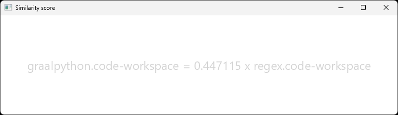
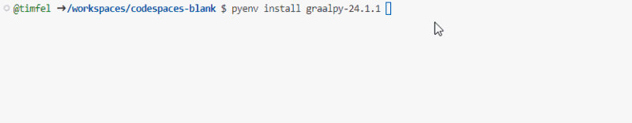
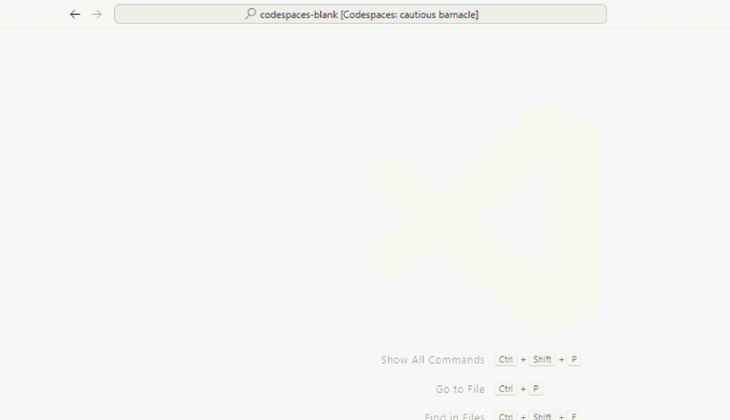
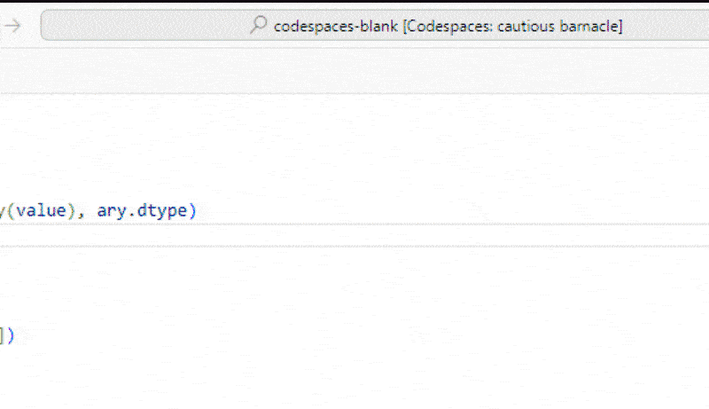

# Using and Debugging Python Scripts in Java Applications using VSCode

Simple, unpackaged Python scripts can be run and shipped with Java applications.
The [GraalVM Polyglot APIs](https://www.graalvm.org/latest/reference-manual/embed-languages/) make it easy to run scripts that are simply included in the Java resources.

## 1. Getting Started

In this guide, we will add a small Python script to calculate the similarity of two files to a JavaFX application:


## 2. What you will need

To complete this guide, you will need the following:

 * Some time on your hands
 * A decent text editor or IDE
 * A supported JDK[^1], preferably the latest [GraalVM JDK](https://graalvm.org/downloads/)

 [^1]: Oracle JDK 17 and OpenJDK 17 are supported with interpreter only for GraalPy, but JavaFX requires JDK 21 or newer.
 GraalVM JDK 21, Oracle JDK 21, OpenJDK 21 and offer GraalPy [JIT compilation](https://www.graalvm.org/latest/reference-manual/embed-languages/#runtime-optimization-support).
 Note: GraalVM for JDK 17 is **not supported** for GraalPy.

## 3. Solution

We encourage you to check out the [completed example](./) and follow with this guide step by step.

## 4. Writing the application

You can use either Maven or Gradle to run the JavaFX example application.

If you want to follow along using Maven, you can start with this minimal `pom.xml`:
```xml
<project>
  <modelVersion>4.0.0</modelVersion>
  <groupId>org.example</groupId>
  <artifactId>javafx-demo</artifactId>
  <version>1.0-SNAPSHOT</version>

  <dependencies>
    <dependency>
      <groupId>org.openjfx</groupId>
      <artifactId>javafx-controls</artifactId>
      <version>24.0.2</version>
    </dependency>
  </dependencies>

  <build>
    <plugins>
      <plugin>
        <groupId>org.openjfx</groupId>
        <artifactId>javafx-maven-plugin</artifactId>
        <version>0.0.8</version>
        <configuration>
          <mainClass>App</mainClass>
        </configuration>
      </plugin>
    </plugins>
  </build>
</project>
```

To follow along with Gradle, you can start with this minimal `build.gradle.kts`:
```kotlin
plugins {
    application;
    id("org.openjfx.javafxplugin") version "0.1.0"
}

javafx {
    version = "24.0.2"
    modules = listOf("javafx.controls")
}

repositories { mavenCentral() }

application { mainClass = "App" }
```

We will demonstrate on both build systems.

## 4.1 Dependency configuration

Add the required dependencies for GraalPy in the `<dependencies>` section of the POM or to the `dependencies` block in the `build.gradle.kts` file.

`pom.xml`
```xml
<dependency>
    <groupId>org.graalvm.polyglot</groupId>
    <artifactId>python</artifactId> <!-- ① -->
    <version>25.0.0</version>
    <type>pom</type> <!-- ② -->
</dependency>
<dependency>
    <groupId>org.graalvm.polyglot</groupId>
    <artifactId>polyglot</artifactId> <!-- ③ -->
    <version>25.0.0</version>
</dependency>
<dependency>
    <groupId>org.graalvm.tools</groupId>
    <artifactId>dap-tool</artifactId> <!-- ④ -->
    <version>25.0.0</version>
</dependency>
```

`build.gradle.kts`
```kotlin
dependencies {
    implementation("org.graalvm.polyglot:python:25.0.0") // ①
    implementation("org.graalvm.polyglot:polyglot:25.0.0") // ③
    implementation("org.graalvm.tools:dap-tool:25.0.0") // ④
}
```

❶ The `python` dependency is a meta-package that transitively depends on all resources and libraries to run GraalPy.

❷ Note that the `python` package is not a JAR - it is simply a `pom` that declares more dependencies.

❸ The `polyglot` dependency provides the APIs to manage and use GraalPy from Java.

❹ The `dap` dependency provides a remote debugger for GraalPy that we can use when Python code is embedded in a Java application.

## 4.2 Adding a Python script

We can just include simple Python scripts in our resources source folder.
In this example, the script contains a function that uses the Python standard library to compute the similarity between two files.

`src/main/resources/compare_files.py`
```python
import polyglot  # pyright: ignore

from difflib import SequenceMatcher
from os import PathLike


@polyglot.export_value # ①
def compare_files(a: PathLike, b: PathLike) -> float:
    with open(a) as file_1, open(b) as file_2: 
        file1_data = file_1.read() 
        file2_data = file_2.read() 
        similarity_ratio = SequenceMatcher(None, file1_data, file2_data).ratio()
        return similarity_ratio
```

❶ The only GraalPy-specific code here is this `polyglot.export_value` annotation, which makes the function accessible by name to the Java world.

## 4.2.1 Working with GraalPy in VSCode

You can use [pyenv](https://github.com/pyenv/pyenv) or [pyenv-win](https://github.com/pyenv-win/pyenv-win) with the [Python extensions](https://marketplace.visualstudio.com/items?itemName=ms-python.python) in VSCode to setup and use GraalPy during development.
You can than edit and debug your Python files using the standard Python tooling.





## 4.3 Creating a Python context

GraalVM provides Polyglot APIs to make starting a Python context easy.
We create the Python context in the JavaFX `start` method.
We also override the `stop` method to close the context and free any associated resources.

`App.java`
```java
public class App extends Application {
    private Context context;

    public static void main(String[] args) {
        Application.launch(args);
    }

    @Override
    public void stop() throws Exception {
        context.close();
        super.stop();
    }

    @Override
    public void start(Stage stage) {
        context = Context.newBuilder("python")
            .allowIO(IOAccess.newBuilder() // ①
                            .fileSystem(FileSystem.newReadOnlyFileSystem(FileSystem.newDefaultFileSystem()))
                            .build())
            .allowPolyglotAccess(PolyglotAccess.newBuilder() // ②
                            .allowBindingsAccess("python")
                            .build())
            // Above are all the options we need to run the app
            // The options below  allow us to debug the Python code while running in Java
            .option("dap", "localhost:4711")
            .option("dap.Suspend", "false")
            .build();

        setupWindow(stage);
    }
```

❶ By default, GraalPy will be sandboxed completely, but our script wants to access files.
Read-only access is enough for this case, so we grant no more.

❷ Our script exposes the `compare_files` function by name to the Java world.
We explicitly allow this as well.

## 4.4 Creating a JavaFX Window

We create a simple window with a target to drop files on to for comparison:

`App.java`
```
private void setupWindow(Stage stage) {
    stage.setTitle("Similarity score");

    StackPane root = new StackPane();
    Scene scene = new Scene(root, 800, 200);

    final Text target = new Text(200, 100, "DROP FILES HERE");
    target.setTextAlignment(TextAlignment.CENTER);
    resetTargetColor(target);
    target.setScaleX(2.0);
    target.setScaleY(2.0);
    StackPane.setMargin(target, new Insets(10, 10, 10, 10));

    target.setOnDragOver((event) -> {
        if (event.getGestureSource() != target && event.getDragboard().hasFiles()) {
            event.acceptTransferModes(TransferMode.ANY);
        }
        event.consume();
    }
    );

    target.setOnDragEntered((event) -> {
        if (event.getGestureSource() != target && event.getDragboard().hasFiles() && event.getDragboard().getFiles().size() == 2) {
            target.setFill(Color.GREEN);
        } else {
            target.setText("Drop 2 files to compare.");
        }
        event.consume();
    }
    );

    target.setOnDragExited((event) -> {
        resetTargetColor(target);
        event.consume();
    });

    setupFileComparison(target);

    root.getChildren().add(target);
    stage.setScene(scene);

    stage.show();

    if (getParameters().getRaw().contains("CI")) {
        stage.close();
    }
}

private static void resetTargetColor(final Text target) {
    target.setFill(Color.LIGHTGRAY);
}
```

## 4.5 Calling the Python script from Java

To do the actual comparison of files through Python, we get the script and set it up to be called in the drop handler:

`App.java`
```java
private void setupFileComparison(final Text target) {
    try {
        context.eval(Source.newBuilder("python", App.class.getResource("/compare_files.py")).build());  // ①
    } catch (IOException e) {
        throw new RuntimeException(e);
    }
    final Value compareFiles = context.getBindings("python").getMember("compare_files"); // ②

    target.setOnDragDropped((event) -> {
        boolean success = false;
        List<File> files;
        if ((files = event.getDragboard().getFiles()) != null && files.size() == 2) {
            try {
                File file0 = files.get(0), file1 = files.get(1);
                double result = compareFiles.execute(file0.getAbsolutePath(), file1.getAbsolutePath()).asDouble(); // ③
                target.setText(String.format("%s = %f x %s", file0.getName(), result, file1.getName()));
                success = true;
            } catch (RuntimeException e) {
                target.setText(e.getMessage());
            }
        }
        resetTargetColor(target);
        event.setDropCompleted(success);
        event.consume();
    });
}
```

❶ We can pass a resource URL to the GraalVM Polyglot [`Source`](https://docs.oracle.com/en/graalvm/enterprise/20/sdk/org/graalvm/polyglot/Source.html) API.
The content is read by the `Source` object, GraalPy and the Python code do not gain access to Java resources this way.

❷ Python objects are returned using a generic [`Value`](https://docs.oracle.com/en/graalvm/enterprise/20/sdk/org/graalvm/polyglot/Value.html) type.

❸ As a Python function, `compare_files` can be executed.
GraalPy accepts Java objects and tries to match them to the appropriate Python types.
Return values are again represented as `Value`.
In this case we know the result will be a Python `float`, which can be converted to a Java `double`.

## 5. Running the application

If you followed along with the example, you can now compile and run your application from the commandline:

With Maven:

```shell
./mvnw compile
./mvnw javafx:run
```

With Gradle:

```shell
./gradlew assemble
./gradlwe run
```

**Note:** If you do not use the Maven or Gradle wrappers, the commands would just be `mvn` and `gradle` to use them from your `PATH`.

## 5.1 Debugging embedded Python code

Your Python code may behave differently when run in a Java embedding.
This can have many reasons, from different types passed in from Java, permissions of the GraalVM Polyglot sandbox, to Python libraries assuming OS-specific process properties that Java applications do not expose.

To debug Python scripts, we recommend you use VSCode.
Make sure you have installed the [Python extensions](https://marketplace.visualstudio.com/items?itemName=ms-python.python).
Where we build the Python context, we already added the following options to enable remote debugging:

`App.java`
```java
.option("dap", "localhost:4711")
.option("dap.Suspend", "false")
```

This instructs the runtime to accept [DAP]() connections on port 4711 and continue execution.
We add a debug configuration to VSCode to match:

`.vscode/launch.json`
```json
{
    "configurations": [{
        "name": "GraalPy: Attach embedded",
        "type": "debugpy",
        "request": "attach",
        "connect": { "host": "localhost", "port": 4711 },
    }]
}
```

When we run the application, we see the following output:

```
[Graal DAP] Starting server and listening on localhost/127.0.0.1:4711
```

We can connect using VSCode or any other DAP client.
The loaded sources can be opened from the **debugger panel** to view the Python code as loaded from the Java resources.
VSCode does not map them back to the files in the source tree, so you must open them from the "Loaded Scripts" section in the debug view.
There can set breakpoints and inspect runtime state as we would expect.


## 6. Next steps

- Use GraalPy with popular Java frameworks, such as [Spring Boot](../graalpy-spring-boot-guide/README.md) or [Micronaut](../graalpy-micronaut-guide/README.md)
- [Migrate from Jython](../graalpy-jython-guide/README.md) to GraalPy
- Learn more about the Polyglot API for [embedding languages](https://www.graalvm.org/latest/reference-manual/embed-languages/)
- Explore in depth with GraalPy [reference manual](https://www.graalvm.org/latest/reference-manual/python/)
