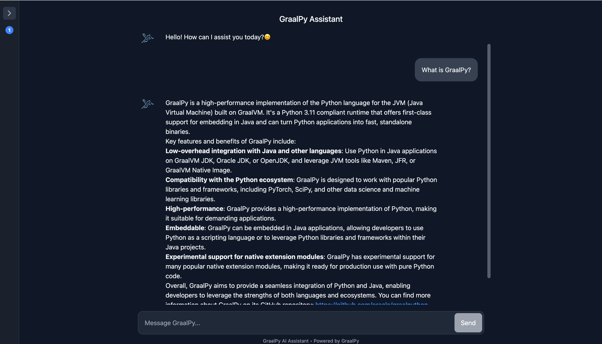

## GraalPy AI Assistant Guide

## 1. Getting Started

In this guide, we will demonstrate how to use Python libraries and framework (LangChain) within a Micronaut application written in Java to build a GraalPy AI Assistant.

## 2. What you will need

To complete this guide, you will need the following:

* Some time on your hands
* A decent text editor or IDE
* A supported JDK[^1], preferably the latest [GraalVM JDK](https://graalvm.org/downloads/)

  [^1]: Oracle JDK 17 and OpenJDK 17 are supported with interpreter only.
  GraalVM JDK 21, Oracle JDK 21, OpenJDK 21 and newer with [JIT compilation](https://www.graalvm.org/latest/reference-manual/embed-languages/#runtime-optimization-support).
  Note: GraalVM for JDK 17 is **not supported**.

* An API key from [Groq](https://console.groq.com/keys)
* An API key from [Cohere](https://dashboard.cohere.com/api-keys)

## 3. Writing the application

Create an application using the [Micronaut Command Line Interface](https://docs.micronaut.io/latest/guide/#cli) or with [Micronaut Launch](https://micronaut.io/launch/).
To make copying of the code snippets in this guide as smooth as possible, the application should have the base package `com.example`.
We also recommend to use Micronaut version 4.7.6 or newer.


```bash
mn create-app com.example.demo \
--build=maven \
--lang=java \
--test=junit
```


### 3.1. Application

The generated Micronaut application will already contain the file  _Application.java_, which is used when running the application via Maven or via deployment.
You can also run the main class directly within your IDE if it is configured correctly.

`src/main/java/org/example/Application.java`
```java
package com.example;
import io.micronaut.runtime.Micronaut;

public class Application {

  public static void main(String[] args) {
    Micronaut.run(Application.class, args);
  }
}
```

### 3.2 Dependency configuration

Add the required dependencies for GraalPy in the dependency section of the POM build script.

`pom.xml`
```xml
<dependency>
  <groupId>org.graalvm.python</groupId>
  <artifactId>python</artifactId> <!-- ① -->
  <version>24.2.0</version>
  <type>pom</type> <!-- ② -->
</dependency>
<dependency>
  <groupId>org.graalvm.python</groupId>
  <artifactId>python-embedding</artifactId> <!-- ③ -->
  <version>24.2.0</version>
</dependency>
```


❶ The `python` dependency is a meta-package that transitively depends on all resources and libraries to run GraalPy.

❷ Note that the `python` package is not a JAR - it is simply a `pom` that declares more dependencies.

❸ The `python-embedding` dependency provides the APIs to manage and use GraalPy from Java.

### 3.3 Adding packages - GraalPy build plugin configuration

Most Python packages are hosted on [PyPI](https://pypi.org) and can be installed via the `pip` tool.
The Python ecosystem has conventions about the filesystem layout of installed packages that need to be kept in mind when embedding into Java.
You can use the GraalPy plugins for Maven to manage Python packages for you.

Add the `graalpy-maven-plugin` configuration into the plugins section of the POM or the `org.graalvm.python` plugin dependency and a `graalPy` block to your Gradle build:

`pom.xml`
```xml
 <plugin>
  <groupId>org.graalvm.python</groupId>
  <artifactId>graalpy-maven-plugin</artifactId>
  <version>${python.version}</version>
  <configuration>
    <packages> <!-- ① -->
      <package>cohere==5.14.2</package>
      <package>beautifulsoup4==4.13.4</package>
      <package>oracledb==3.1.0</package>
      <package>jellyfish==0.8.0</package>
      <package>langchain==0.3.23</package>
      <package>langchain-cohere==0.4.3</package>
      <package>langchain-community==0.3.21</package>
      <package>langchain-core==0.3.51</package>
      <package>langchain-groq==0.3.2</package>
      <package>langchain-text-splitters==0.3.8</package>
      <package>langchain-ollama==0.2.3</package>
      <package>pydantic==2.11.0a2</package>
      <package>pydantic_core==2.29.0</package>
      <package>tokenizers==0.15.0</package>
      <package>huggingface-hub==0.16.4</package>
      <package>yake==0.4.8</package>
      <package>numpy==1.26.4</package>
      <package>cx-Oracle</package>
    </packages>
  </configuration>
  <executions>
    <execution>
      <goals>
        <goal>process-graalpy-resources</goal>
      </goals>
    </execution>
  </executions>
</plugin>
```


❶ The `packages` section lists all Python packages optionally with [requirement specifiers](https://pip.pypa.io/en/stable/reference/requirement-specifiers/).

Python packages and their versions can be specified as if used with pip.

### 3.4 Creating a Python context

GraalPy provides APIs to make setting up a context to load Python packages from Java as easy as possible.

Create a Java class which will serve as a wrapper bean for the GraalPy context:

`src/main/java/com/example/config/GraalPyContext.java`
```java
package com.example.config;

import io.micronaut.context.annotation.Context;
import jakarta.annotation.PreDestroy;
import org.graalvm.polyglot.EnvironmentAccess;
import org.graalvm.python.embedding.GraalPyResources;
import java.io.IOException;

@Context // ①
public class GraalPyContext {

  public static final String PYTHON="python";
  private final org.graalvm.polyglot.Context context;

  public GraalPyContext() throws IOException {


    context= GraalPyResources.contextBuilder()
            .allowEnvironmentAccess(EnvironmentAccess.INHERIT) // ②
            .option("python.WarnExperimentalFeatures", "false") // ③
            .build();


    context.initialize(PYTHON); // ④
  }

  public org.graalvm.polyglot.Context getContext() {

    return context; // ⑤
  }

  @PreDestroy
  void close(){
    try {
      context.close(true); // ⑥
    } catch (Exception e) {
      //ignore
    }
  }
}
```
❶ Eagerly initialize as a singleton bean.

❷ Allow environment access.

❸ Set GraalPy option to not log a warning every time a native extension is loaded.

❹ Initializing a GraalPy context isn't cheap, so we do so already at creation time to avoid delayed response time.

❺ Return the GraalPy context.

❻ Close the GraalPy context.


### 3.5 Binding Java interface with Python code
Define a Java interface with the methods we want to bind.

`GenerateAnswerModule.java`

```java
package com.example.services;

import org.graalvm.polyglot.Value;

public interface GenerateAnswerModule {

    String process_question(String question, Value documents);
}

```

Define a Micronaut service `RagPipelineService.java`.

```java
package com.example.services;

import com.example.config.GraalPyContext;
import jakarta.inject.Singleton;
import org.graalvm.polyglot.Value;

import static com.example.config.GraalPyContext.PYTHON;


@Singleton
public class RagPipelineService {


  private final GenerateAnswerModule generateAnswerModule;
  private final InitialDataModule initialDataModule;
  private final RetrievalModule retrievalModule;
  private final ExternalDataModule externalDataModule;
  public static final String TABLE_NAME = "VECTOR_STORE";

  public RagPipelineService(GraalPyContext graalPyContext)  {


    graalPyContext.getContext().eval(PYTHON, "import generation, prepare_initial_data, external_data_processing, retrieval"); // ①
    Value generation_module = graalPyContext.getContext().getBindings(PYTHON).getMember("generation"); // ②
    Value retrieval_module = graalPyContext.getContext().getBindings(PYTHON).getMember("retrieval");
    Value initial_data_module = graalPyContext.getContext().getBindings(PYTHON).getMember("prepare_initial_data");
    Value external_data_module = graalPyContext.getContext().getBindings(PYTHON).getMember("external_data_processing");

    Value generateAnswerClass = generation_module.getMember("GenerateAnswer"); // ③
    Value retrievalClass = retrieval_module.getMember("Retrieval");
    Value initialDataClass = initial_data_module.getMember("InitialData");
    Value externalDataClass = external_data_module.getMember("ExternalData");


    generateAnswerModule = generateAnswerClass.newInstance().as(GenerateAnswerModule.class); // ④
    retrievalModule = retrievalClass.newInstance(TABLE_NAME).as(RetrievalModule.class);
    initialDataModule = initialDataClass.newInstance(TABLE_NAME).as(InitialDataModule.class);
    externalDataModule = externalDataClass.newInstance(TABLE_NAME).as(ExternalDataModule.class);

  }

  public String generateAnswer(String question, Value retrievedDocuments) {
    return generateAnswerModule.process_question(question, retrievedDocuments); // ⑤
  }

  public Value hybridSearch(String question, int numResults) {
    return retrievalModule.hybrid_search(question, numResults);
  }

  public AddUrlResultType addURL(String url){
    if(!externalDataModule.is_graalpy_related(url)){
      return AddUrlResultType.INVALID_URL;
    }
    if(!externalDataModule.add_url(url)){
      return AddUrlResultType.DUPLICATE;
    }
    return AddUrlResultType.SUCCESS;
  }

  public String addText(String text){
    externalDataModule.add_new_text(text);
    return "The text has been successfully added";
  }

  public Boolean checkDbInit(){
    return initialDataModule.check_db_init();
  }

  public void loadDataFromWebSite(String url, String className){
    initialDataModule.load_data_from_url_process(url, className);
  }
  public void loadDataFromFile(String fileName){
    initialDataModule.load_data_from_file_process(fileName);

  }

  public void CreateTextIndex(){
    initialDataModule.create_text_index();
  }
  
}
```

❶ This imports Python modules, which should be located at `org.graalvm.python.vfs/src`. making them available in the global namespace.

❷ Retrieve the Python "bindings".
This is an object that provides access to Python global namespace. One can read, add, or remove global variables using this object.

❸ Get the `GenerateAnswer` Class from the imported Python module.

❹ Instantiate the Python class and binds it to the corresponding Java interface `GenerateAnswerModule`.

❺ Call the Python method through the Java interface.

### 3.6 Controller

To create a microservice that provides LLM-powered question answering using Retrieval-Augmented Generation(RAG), you also need a controller:

`src/main/java/com/example/controllers/RagController.java`

```java
    @Post(value = "/answer")
    public String getAnswer(@Body Map<String, String> body) { // ①
      String query = body.get("query");
      Value retrievedDocs = service.hybridSearch(query, 4); // ②
      return service.generateAnswer(query, retrievedDocs); // ③
    }
```

❶ expose `api/llm/answer` endpoint, you can use Postman or cURL to test it.
```shell
curl -X POST http://localhost:8080/api/llm/answer \
-H "Content_Type: application/json"\
-d '{"query" : "put your question here"}'
```

❷ Uses the `retrievalModule` (via the `hybridSearch` method in the service) to execute the corresponding Python function and retrieve relevant documents as a `Value`.

❸ Passes the retrieved documents to the `generateAnswer` method in the service, which calls the corresponding Python method to generate an answer using the LLM.


### 3.7 Test
Create a test to verify that when you make a POST request to you get the expected response:

`src/test/java/com/example/controllers/RagControllerIntegrationTest.java`

```java
    @Test
    void givenRelatedGraalPyQuestion_whenCallingGetAnswerEndpoint_thenReturnsExpectedAnswer() {
    
      //Arrange
      String query = "What is GraalPy?"; // ①
    
      //Act
      HttpRequest<?> req = HttpRequest.POST("/answer", Map.of("query", query))
              .contentType(MediaType.APPLICATION_JSON); // ②
      HttpResponse<String> rsp = client.toBlocking().exchange(req, String.class);
    
      //Assert
      assertEquals(HttpStatus.OK,rsp.getStatus()); // ③
      assert(rsp.body().toLowerCase().contains("graalpy"));
      assert (rsp.body().toLowerCase().contains("embedding"));
      assert (rsp.body().toLowerCase().contains("language"));
    
    }
```

❶ Prepares the test input to be sent to the `/api/llm/answer` endpoint.

❷ Builds an HTTP POST request, with the query included in the request body as JSON `({"query": "What is GraalPy?"})`.

❸ Verifies The HTTP response status is OK and that the response body contains the expected keywords.


### 3.7 Running the Application

#### With docker

* Add your API keys to `.env file`

```shell
GROQ_API_KEY=PUT_YOUR_GROQ_API_KEY_HERE
COHERE_API_KEY=PUT_YOUR_COHERE_API_KEY_HERE
```

* Run the following command to start the services using Docker Compose:

```shell
docker-compose up 
```

#### Without Docker
To run the application without Docker, please check the `backend subdirectory` for instructions.


